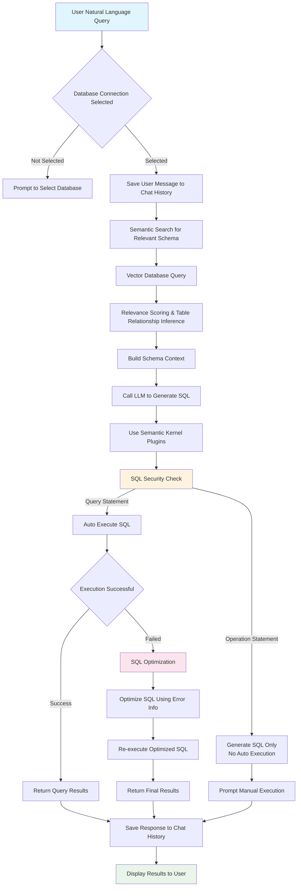
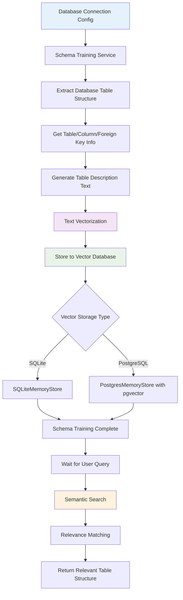
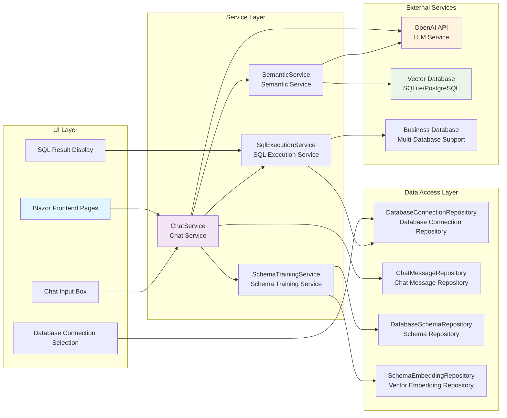

[简体中文](./README.md) | English

## A simple .NET implementation of Text2SQL


This project supports SQL Server, MySQL, PostgreSQL and SQLite. Configuration example:

```json
"Text2SqlOpenAI": {
  "Key": "your-api-key",
  "EndPoint": "https://api.antsk.cn/",
  "ChatModel": "gpt-4o",
  "EmbeddingModel": "text-embedding-ada-002"
},
"Text2SqlConnection": {
  "DbType": "Sqlite", //PostgreSQL
  "DBConnection": "Data Source=text2sql.db",
  "VectorConnection": "text2sqlmem.db",
  "VectorSize": 1536 //Required for PostgreSQL, optional for SQLite
}
```

### Core Modules
1. **Database Abstraction Layer**
   - Multi-database support via strategy pattern
   - Standardized operations through IDatabaseProvider interface
   - Dynamic loading of database drivers (SQLite/Postgres/MySql/SqlServer)
   - Auto-generated database-specific SQL dialects

4. **Vector Database Integration**
   - SQLite in-memory vector search
   - PostgreSQL pgvector extension support
   - Unified IVectorRepository interface
   - Cosine similarity/Euclidean distance calculations

## Core Process Flow


## Schema Training & Vector Search Flow


## System Architecture


## Community
Join our developer community through WeChat (ID: xuzeyu91) or visit [AntSK](https://demo.antsk.cn) for more RAG solutions.

