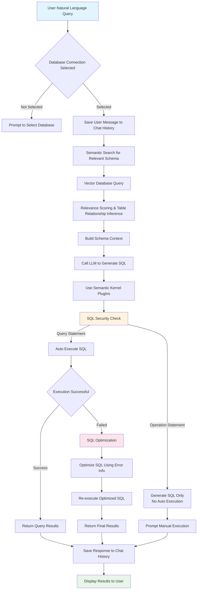
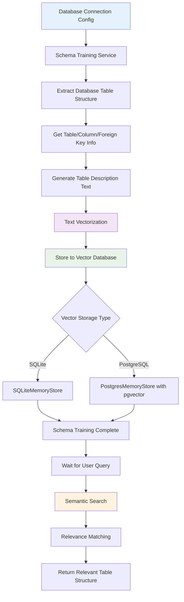
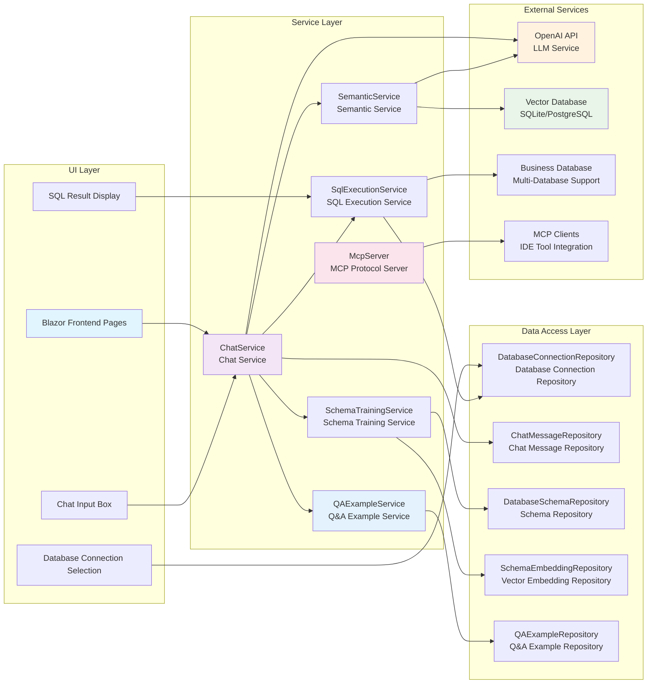

[简体中文](./README.md) | English

## A simple .NET implementation of Text2SQL


### Core Features
- **Natural Language to SQL**: Convert everyday language descriptions into SQL queries automatically
- **Multi-Database Support**: Compatible with SQL Server, MySQL, PostgreSQL, and SQLite
- **Intelligent Context Understanding**: Based on chat history to understand user query intent
- **Vector Search Integration**: Support semantic similarity search
- **Syntax Validation**: Automatically check generated SQL syntax correctness
- **MCP Protocol Support**: Seamless integration with IDE tools (Cursor, Trae, etc.)
- **Intelligent Q&A Example System**: Improve SQL generation accuracy through example learning

This project supports SQL Server, MySQL, PostgreSQL and SQLite. Configuration example:

```json
"Text2SqlOpenAI": {
  "Key": "your-api-key",
  "EndPoint": "https://api.antsk.cn/",
  "ChatModel": "gpt-4o",
  "EmbeddingModel": "text-embedding-ada-002"
},
"Text2SqlConnection": {
  "DbType": "Sqlite", //PostgreSQL
  "DBConnection": "Data Source=text2sql.db",
  "VectorConnection": "text2sqlmem.db",
  "VectorSize": 1536 //Required for PostgreSQL, optional for SQLite
}
```

### Core Modules
1. **Database Abstraction Layer**
   - Multi-database support via strategy pattern
   - Standardized operations through IDatabaseProvider interface
   - Dynamic loading of database drivers (SQLite/Postgres/MySql/SqlServer)
   - Auto-generated database-specific SQL dialects

4. **Vector Database Integration**
   - SQLite in-memory vector search
   - PostgreSQL pgvector extension support
   - Unified IVectorRepository interface
   - Cosine similarity/Euclidean distance calculations

5. **Q&A Example System**
   - Manual and correction-based example creation
   - Semantic search for relevant examples
   - Category organization and usage statistics
   - Batch operations and example management

6. **MCP Protocol Server**
   - Full Text2SQL functionality via MCP tools
   - IDE integration support (Cursor, Trae, etc.)
   - Database schema and query execution tools
   - Context-aware connection management

## Core Process Flow


## Schema Training & Vector Search Flow


## System Architecture


## 🔧 MCP Protocol Integration

### Model Context Protocol (MCP) Support
Text2Sql.Net integrates Model Context Protocol, serving as an MCP server to provide Text2SQL functionality for various AI development tools.

#### Supported MCP Tools
- `get_database_connections`: Get all database connection configurations
- `get_database_schema`: Get database table structure information
- `generate_sql`: Generate SQL queries from natural language
- `execute_sql`: Execute SQL query statements
- `get_chat_history`: Get chat history records
- `get_table_structure`: Get detailed structure of specified tables
- `get_all_tables`: Get all table information

#### IDE Integration Configuration
In MCP-supported IDEs (such as Cursor, Trae, etc.), you can connect to Text2Sql.Net with the following configuration:

```json
{
  "mcpServers": {
    "text2sql": {
      "name": "Text2Sql.Net - sqlserver",
      "type": "sse",
      "description": "智能Text2SQL服务 - 。支持自然语言转SQL查询。兼容Cursor、Trae等IDE。",
      "isActive": true,
      "url": "http://localhost:5000/mcp/sse?connectionId=xxxxxx"
    }
  }
}
```

After configuration, you can directly interact with databases using natural language in your IDE:
- "Show the structure of all user tables"
- "Query order data from the last week"
- "Count the number of products in each category"

### MCP Use Cases
1. **Code Development**: Quickly generate database query code in IDE
2. **Data Analysis**: Rapidly explore data through natural language
3. **Report Generation**: Quickly build complex statistical queries
4. **System Integration**: Integrate Text2SQL capabilities into other tool chains

## 📚 Intelligent Q&A Example System

### Q&A Example Features
Text2Sql.Net provides an intelligent Q&A example management system that improves SQL generation accuracy through learning and accumulating examples.

#### Core Features
- **Example Management**: Support manual creation and correction-generated Q&A examples
- **Semantic Search**: Match relevant examples based on vector similarity
- **Category Organization**: Support basic queries, complex queries, aggregate queries, etc.
- **Usage Statistics**: Track example usage frequency and effectiveness
- **Batch Operations**: Support batch enable, disable, and delete examples

#### Example Categories
- **Basic Queries**: Simple SELECT statements and basic filtering
- **Complex Queries**: Multi-table joins, subqueries, and complex scenarios
- **Aggregate Queries**: Include GROUP BY, SUM, COUNT and other aggregate functions
- **Join Queries**: Multi-table JOIN operations
- **Correction Examples**: Examples generated from incorrect SQL corrections

#### Intelligent Matching Mechanism
When users input queries, the system will:
1. Vectorize the user question
2. Perform semantic search in the example library
3. Return the most relevant examples (default relevance threshold 0.7)
4. Provide relevant examples as context to LLM
5. Update example usage statistics

#### Example Format
```json
{
  "question": "Query the number of active users in the last month",
  "sqlQuery": "SELECT COUNT(DISTINCT user_id) FROM user_activities WHERE activity_date >= DATE_SUB(NOW(), INTERVAL 1 MONTH)",
  "category": "aggregate",
  "description": "Count distinct users with activity records in the last 30 days"
}
```

### Example Creation Methods
1. **Manual Creation**: Directly add Q&A pairs in the management interface
2. **Correction Generation**: Automatically create examples when users correct wrong SQL
3. **Batch Import**: Support batch generation of examples from existing query history

## Community
Join our developer community through WeChat (ID: xuzeyu91) or visit [AntSK](https://demo.antsk.cn) for more RAG solutions.

