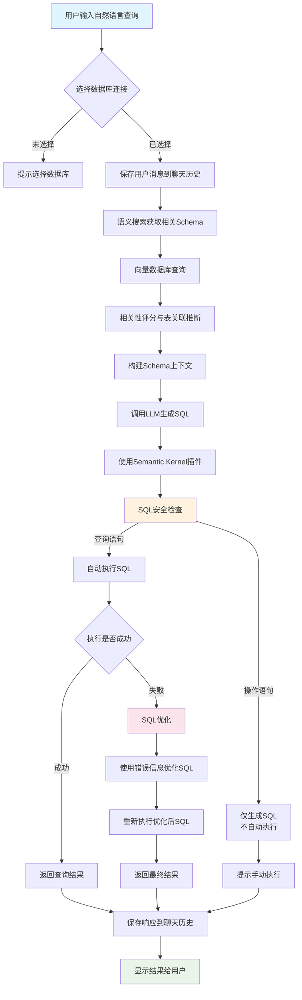
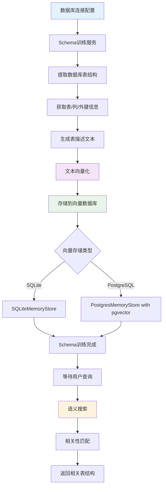
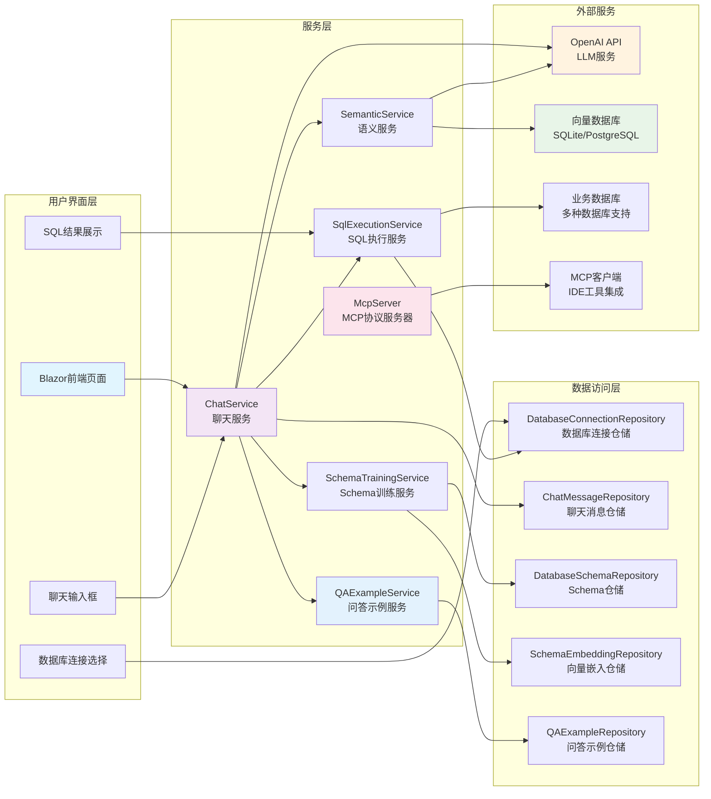

简体中文 | [English](./README.en.md) 

## Text2Sql.Net - 自然语言转SQL的.NET实现

### 项目背景
Text2Sql.Net是一个基于.NET平台的自然语言转SQL工具，旨在帮助开发者和数据分析师通过简单的自然语言描述快速生成数据库查询语句。项目结合了大型语言模型(LLM)和传统SQL解析技术，支持多种主流数据库。

### 核心功能
- 自然语言转SQL：输入日常语言描述，自动生成对应的SQL查询语句
- 多数据库支持：兼容SQL Server、MySQL、PostgreSQL和SQLite
- 智能上下文理解：基于聊天历史理解用户查询意图
- 向量搜索集成：支持基于语义的相似度搜索
- 语法校验：自动检查生成的SQL语法正确性
- **MCP协议支持**：与IDE工具（Cursor、Trae等）无缝集成
- **智能问答示例系统**：通过示例学习提升SQL生成准确性

## 技术架构


配置文件。项目支持使用sqlite或者pgsql运行，支持配置SqlService、MySql、PgSql、Sqlite进行Text2Sql 
```
  "Text2SqlOpenAI": {
    "Key": "你的秘钥",
    "EndPoint": "https://api.antsk.cn/",
    "ChatModel": "gpt-4o",
    "EmbeddingModel": "text-embedding-ada-002"
  },
  "Text2SqlConnection": {
    "DbType": "Sqlite", //PostgreSQL
    "DBConnection": "Data Source=text2sql.db",
    "VectorConnection": "text2sqlmem.db",
    "VectorSize": 1536 //PostgreSQL需要设置，sqlite可以不设置
  }
```

也欢迎大家加入我们的微信交流群，可以添加我的微信：**xuzeyu91** 发送进群

### 核心模块
 **数据库适配层**

 **向量数据库集成**
   - 基于策略模式实现多数据库支持
   - 通过IDatabaseProvider接口定义标准操作
   - 动态加载对应数据库驱动（SQLite/Postgres/MySql/SqlServer）
   - 自动生成数据库特定方言的SQL语句

## 核心处理流程


## Schema训练与向量搜索流程


## 系统架构图


## 🔧 MCP协议集成

### Model Context Protocol (MCP) 支持
Text2Sql.Net 集成了 Model Context Protocol，可以作为 MCP 服务器为各种 AI 开发工具提供 Text2SQL 功能。

#### 支持的MCP工具
- `get_database_connections`: 获取所有数据库连接配置
- `get_database_schema`: 获取数据库表结构信息
- `generate_sql`: 根据自然语言生成SQL查询
- `execute_sql`: 执行SQL查询语句
- `get_chat_history`: 获取聊天历史记录
- `get_table_structure`: 获取指定表的详细结构
- `get_all_tables`: 获取所有表信息

#### IDE集成配置
在支持MCP的IDE中（如Cursor、Trae等），您可以通过以下配置连接到Text2Sql.Net：

```json
{
  "mcpServers": {
    "text2sql": {
      "name": "Text2Sql.Net - sqlserver",
      "type": "sse",
      "description": "智能Text2SQL服务 - 。支持自然语言转SQL查询。兼容Cursor、Trae等IDE。",
      "isActive": true,
      "url": "http://localhost:5000/mcp/sse?connectionId=xxxxxx"
    }
  }
}
```

配置完成后，您可以在IDE中直接使用自然语言与数据库交互：
- "显示所有用户表的结构"
- "查询最近一周的订单数据"
- "统计每个分类的产品数量"

### MCP使用场景
1. **代码开发**: 在IDE中快速生成数据查询代码
2. **数据分析**: 通过自然语言快速探索数据
3. **报表生成**: 快速构建复杂的统计查询
4. **系统集成**: 将Text2SQL能力集成到其他工具链中

## 📚 智能问答示例系统

### QA示例功能
Text2Sql.Net 提供了智能的问答示例管理系统，通过学习和积累示例来提升SQL生成的准确性。

#### 核心特性
- **示例管理**: 支持手动创建和修正生成的问答示例
- **语义搜索**: 基于向量相似度匹配相关示例
- **分类组织**: 支持基础查询、复杂查询、聚合查询等分类
- **使用统计**: 跟踪示例的使用频率和效果
- **批量操作**: 支持批量启用、禁用和删除示例

#### 示例分类说明
- **基础查询**: 简单的SELECT语句和基本过滤
- **复杂查询**: 多表关联、子查询等复杂场景
- **聚合查询**: 包含GROUP BY、SUM、COUNT等聚合函数
- **连接查询**: 多表JOIN操作
- **修正示例**: 从错误SQL修正后生成的示例

#### 智能匹配机制
当用户输入查询时，系统会：
1. 对用户问题进行向量化
2. 在示例库中进行语义搜索
3. 返回最相关的示例（默认相关度阈值0.7）
4. 将相关示例作为上下文提供给LLM
5. 更新示例使用统计

#### 示例格式
```json
{
  "question": "查询最近一个月的活跃用户数量",
  "sqlQuery": "SELECT COUNT(DISTINCT user_id) FROM user_activities WHERE activity_date >= DATE_SUB(NOW(), INTERVAL 1 MONTH)",
  "category": "aggregate",
  "description": "统计最近30天内有活动记录的独立用户数量"
}
```

### 示例创建方式
1. **手动创建**: 在管理界面直接添加问答对
2. **修正生成**: 当SQL生成错误时，用户修正后自动创建示例
3. **批量导入**: 支持从已有的查询历史中批量生成示例

## 更多Rag场景可查看 AntSK
项目地址：[AntSK](https://github.com/AIDotNet/AntSK)

体验环境：

[Demo地址](https://demo.antsk.cn)

账号：test

密码：test


也欢迎大家加入我们的微信交流群，可以添加我的微信：**antskpro** 发送进群
