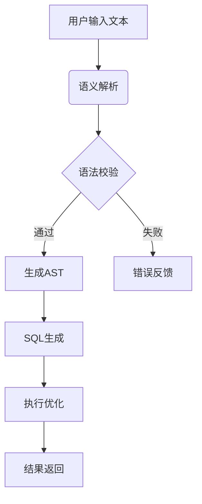
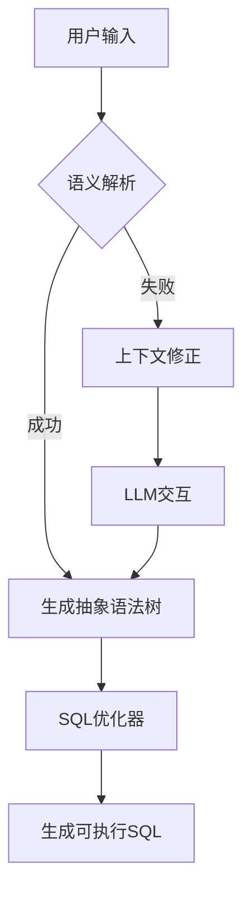

简体中文 | [English](./README.en.md) 

## 这是一个Text2Sql的dotnet简易实现


配置文件。项目支持使用sqlite或者pgsql运行，支持配置SqlService、MySql、PgSql、Sqlite进行Text2Sql 
```
  "Text2SqlOpenAI": {
    "Key": "你的秘钥",
    "EndPoint": "https://api.antsk.cn/",
    "ChatModel": "gpt-4o",
    "EmbeddingModel": "text-embedding-ada-002"
  },
  "Text2SqlConnection": {
    "DbType": "Sqlite", //PostgreSQL
    "DBConnection": "Data Source=text2sql.db",
    "VectorConnection": "text2sqlmem.db",
    "VectorSize": 1536 //PostgreSQL需要设置，sqlite可以不设置
  }
```

也欢迎大家加入我们的微信交流群，可以添加我的微信：**xuzeyu91** 发送进群

### 核心模块
 **数据库适配层**

 **向量数据库集成**
   - 基于策略模式实现多数据库支持
   - 通过IDatabaseProvider接口定义标准操作
   - 动态加载对应数据库驱动（SQLite/Postgres/MySql/SqlServer）
   - 自动生成数据库特定方言的SQL语句

 **向量数据库集成**
   - 基于SQLite的内存数据库实现向量快速检索
   - PostgreSQL使用pgvector扩展支持向量类型
   - 统一向量存储接口IVectorRepository
   - 支持余弦相似度/欧式距离计算

## 核心处理流程


## 核心类说明
### ChatService


