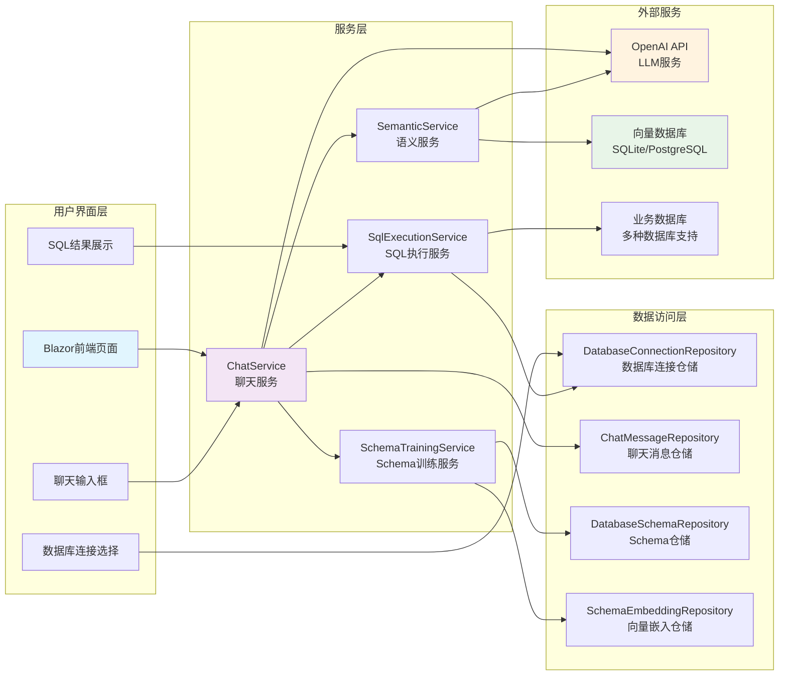

简体中文 | [English](./README.en.md) 

## Text2Sql.Net - 自然语言转SQL的.NET实现

### 项目背景
Text2Sql.Net是一个基于.NET平台的自然语言转SQL工具，旨在帮助开发者和数据分析师通过简单的自然语言描述快速生成数据库查询语句。项目结合了大型语言模型(LLM)和传统SQL解析技术，支持多种主流数据库。

### 核心功能
- 自然语言转SQL：输入日常语言描述，自动生成对应的SQL查询语句
- 多数据库支持：兼容SQL Server、MySQL、PostgreSQL和SQLite
- 智能上下文理解：基于聊天历史理解用户查询意图
- 向量搜索集成：支持基于语义的相似度搜索
- 语法校验：自动检查生成的SQL语法正确性

## 技术架构


配置文件。项目支持使用sqlite或者pgsql运行，支持配置SqlService、MySql、PgSql、Sqlite进行Text2Sql 
```
  "Text2SqlOpenAI": {
    "Key": "你的秘钥",
    "EndPoint": "https://api.antsk.cn/",
    "ChatModel": "gpt-4o",
    "EmbeddingModel": "text-embedding-ada-002"
  },
  "Text2SqlConnection": {
    "DbType": "Sqlite", //PostgreSQL
    "DBConnection": "Data Source=text2sql.db",
    "VectorConnection": "text2sqlmem.db",
    "VectorSize": 1536 //PostgreSQL需要设置，sqlite可以不设置
  }
```

也欢迎大家加入我们的微信交流群，可以添加我的微信：**xuzeyu91** 发送进群

### 核心模块
 **数据库适配层**

 **向量数据库集成**
   - 基于策略模式实现多数据库支持
   - 通过IDatabaseProvider接口定义标准操作
   - 动态加载对应数据库驱动（SQLite/Postgres/MySql/SqlServer）
   - 自动生成数据库特定方言的SQL语句

## 核心处理流程


## Schema训练与向量搜索流程


## 系统架构图


## 更多Rag场景可查看 AntSK
项目地址：[AntSK](https://github.com/AIDotNet/AntSK)

体验环境：

[Demo地址](https://demo.antsk.cn)

账号：test

密码：test


也欢迎大家加入我们的微信交流群，可以添加我的微信：**antskpro** 发送进群
